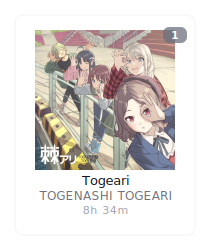
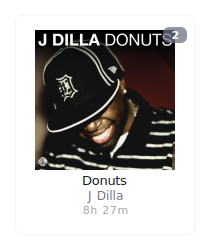
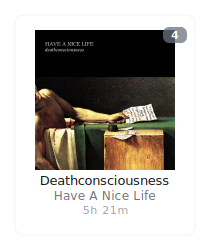
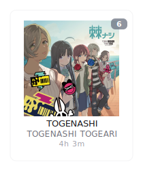
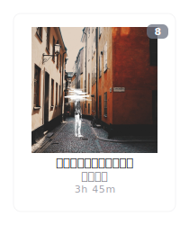
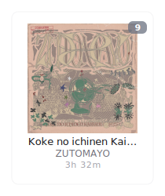

## Hi there 👋, I'm [Tera Ha](https://teraha.com)!
 
## Featured Project: statsfm-to-markdown

I developed **[statsfm-to-markdown](https://github.com/teraha-dev/statsfm-to-markdown)**, a GitHub Action that dynamically updates your profile README with your most listened-to albums from stats.fm (formerly Spotistats). It provides a visually engaging way to showcase musical preferences, featuring:

* Automated fetching and embedding of top album art.
* Configurable time ranges (`weeks`, `months`, `lifetime`) and display limits.
* Optional tooltips displaying rank and playtime.

Integrate it into your own profile or learn more at the [project repository](https://github.com/teraha-dev/statsfm-to-markdown).

<strong>Monthly Rotation</strong>
 

<!-- STATSFM START -->

<!-- STATSFM END -->

## ❤️ Support My Work

If you like what I do and want to support my open-source contributions, please consider becoming a sponsor! Your support helps me dedicate more time to creating and maintaining projects like `statsfm-to-markdown`.

